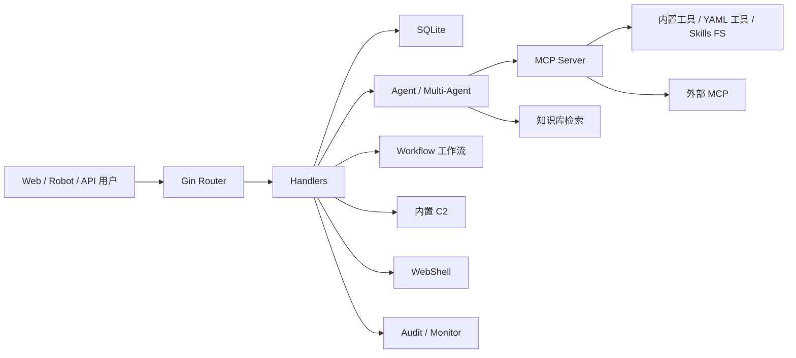

# CyberStrikeAI 产品需求文档（PRD）与技术规格

> 文档版本：v1.0 · 基线代码版本 v1.7.17+ / v1.8.0 安全闭环 · 编制日期 2026-09-03
> 文档语言：简体中文（技术术语、代码标识符、配置键保留英文）
> 证据来源：`README.md`、`docs/zh-CN/*`、`docs/adr/*`、`config.example.yaml`、`go.mod`、`internal/` 代码结构

---

## 第一部分　产品需求文档（PRD）

### 1. 引言

#### 1.1 产品定位

**CyberStrikeAI 是 AI 原生网络安全的智能执行中枢**——让意图转化为受治理的行动，让证据沉淀为运营记忆，并让每次行动优化下一次行动。

CyberStrikeAI 将规划、执行、人工监督、证据与复盘连接在同一个可审计工作空间中。项目基于 **Go** 构建，融合 **Eino 智能体**、**MCP 原生工具**、**RAG 知识**、**可视化工作流**以及**攻击链建模与分析**能力，面向已获得明确授权的安全任务。

#### 1.2 产品愿景

传统安全测试存在三道鸿沟：

1. **意图与执行脱节**：安全工程师能用自然语言描述"我想做什么"，但落地仍需手敲命令、查文档、拼参数。
2. **行动与证据脱节**：测试过程产生的数据散落在终端历史、截图、报告文件里，难以形成可追溯、可复用的运营记忆。
3. **经验与优化脱节**：每次测试都从零开始，没有机制让上一次行动的结果指导下一次行动。

CyberStrikeAI 的愿景是用一个统一的、可审计的、AI 原生的工作空间同时弥合这三道鸿沟：**意图 → 受治理的行动 → 证据沉淀 → 下一次行动优化**。

#### 1.3 目标读者

| 读者 | 关注章节 |
|------|---------|
| 产品负责人 / 项目负责人 | 第 1–6 章（PRD 全部） |
| 架构师 / 技术负责人 | 第 7–8 章（架构与技术规格） |
| 集成开发者 | 第 9 章（API 与接口） |
| 安全负责人 / 合规审计 | 第 10 章（安全与合规） |
| 运维部署人员 | 第 8、10 章 + `docs/zh-CN/deployment.md` |
| 新入职工程师 | 本文 + `docs/ONBOARDING.md` |

#### 1.4 术语表

| 术语 | 含义 |
|------|------|
| **Agent** | Eino 智能体，将自然语言意图转化为受控工具调用 |
| **MCP** | Model Context Protocol，工具调用协议；CyberStrikeAI 既提供内置 MCP 工具，也支持外部 MCP 联邦 |
| **HITL** | Human-In-The-Loop，工具调用前的人工审批层 |
| **RBAC** | Role-Based Access Control，平台级权限模型 |
| **AI 测试角色（Agent Role）** | `roles/*.yaml`，决定 Agent 提示词与可选工具集，非安全边界 |
| **平台角色（RBAC Role）** | 决定用户能调用哪些功能、访问哪些资源 |
| **project scope（授权边界）** | `projects.scope_json`，网络目标语义的硬授权闸门 |
| **Capability Provider** | 破坏性工具（写/创文件）的 plan→validate→execute→rollback 生命周期 |
| **攻击链（Attack Chain）** | 跨会话事实、风险评分、图谱视图、步骤回放的项目级建模 |
| **Deep / Plan-Execute / Supervisor** | Eino 多代理编排模式 |
| **tool_search** | Eino 中间件，按阈值拆分 MCP 工具列表，控制模型可见工具数 |
| **execution_id** | 长任务 worker 执行句柄，支持多轮 `wait_tool_execution` 等待 |

---

### 2. 问题陈述

#### 2.1 现状与痛点

当前授权安全测试团队在进行一次完整渗透测试时，面临以下结构性问题：

| 痛点 | 现状描述 | 后果 |
|------|---------|------|
| **工具碎片化** | 一次测试需组合 nmap、sqlmap、nuclei、subfinder 等 10+ 工具，命令参数靠记忆 | 效率低、易出错、新人门槛高 |
| **结果难沉淀** | 扫描报告散落本地文件，漏洞、资产、证据无法结构化关联 | 无法跨会话复用、无法形成资产基线 |
| **审批缺失** | 高风险操作（执行 payload、写文件、C2 下发）缺乏统一审批闸 | 误操作风险、审计追溯困难 |
| **LLM 命令注入** | LLM 生成的命令可能含 `; rm -rf /`、`$(id)`、越界扫描 | 安全事故 |
| **授权边界靠口头** | 测试范围靠人脑记忆，工具不校验目标是否在授权内 | 越界扫描的法律与业务风险 |
| **长任务阻塞** | sqlmap/nmap/nuclei 动辄数分钟，阻塞 Agent runner | Agent 卡死、上下文爆炸 |
| **大输出撑爆上下文** | nuclei 报告可达 5MB，直接进对话历史 | token 爆炸、数据库膨胀 |
| **多代理协调难** | 侦察、漏洞验证、后渗透需要不同专家能力，单 Agent 难以胜任 | 复杂任务拆解困难 |

#### 2.2 现有方案不足

参考同类项目（Pentest-Swarm-AI、mcpstrike、VulnClaw、strix）的共性：**确定性安全层叠在 LLM 之前，无 LLM 在环**。但它们各自只解决了部分问题——

- 部分项目只做命令注入防护，无授权边界硬闸；
- 部分项目有审批但无攻击链建模与证据沉淀；
- 部分项目有 RAG 但无工具执行治理与长任务隔离；
- 几乎没有项目同时具备 C2、WebShell、RBAC、多代理编排、工作流、知识库的完整闭环。

CyberStrikeAI 的差异化在于：**在同一个可审计工作空间中，把规划、执行、人工监督、证据、复盘与下一次优化打通**。

---

### 3. 目标与成功指标

#### 3.1 产品目标

| 编号 | 目标 | 说明 |
|------|------|------|
| G1 | **意图驱动执行** | 用户用自然语言描述测试意图，Agent 自动选择工具、拼装参数、执行并验证 |
| G2 | **确定性安全治理** | 五闸纵深防御叠在 LLM 之前，零延迟零 token，纯函数可单测 |
| G3 | **证据沉淀为运营记忆** | 对话、工具执行、漏洞、资产、攻击链全部结构化入库，可追溯可复用 |
| G4 | **行动优化下一次行动** | 攻击链建模 + 项目事实注入 + 知识库 RAG + 验证台账，让历史结果指导后续决策 |
| G5 | **多代理编排** | Deep / Plan-Execute / Supervisor 三模式覆盖复杂任务拆解 |
| G6 | **人机协同可调节** | HITL 人工审批 / 审计 Agent 自动审批 / 审查编辑三档可配 |
| G7 | **低门槛部署** | 单体 Go 服务 + SQLite + 静态前端 + 一条命令部署 + 桌面版免登录 |

#### 3.2 成功指标

| 指标 | 目标值 | 验证方式 |
|------|--------|---------|
| 五闸安全层单测覆盖 | 100% 纯函数覆盖 | `go test ./internal/security/...` 全绿 |
| 核心包测试覆盖率 | audit ≥90%、workflow ≥87%、knowledge ≥86% | `go test -cover`（A4 批次已达成） |
| 双驱动路径 | CGO=1 mingw 与 `-tags sqlite_pure_go` 互验不新增 FAIL | 全仓 `go test` 双路径 |
| 工具治理 | Agent 只有限等待，长任务不阻塞 runner | `execution_id` 多轮等待机制可用 |
| 大输出兜底 | DB 与 Agent 视图一致，恢复不撑爆上下文 | model-facing trace 裁剪验证 |
| 部署门槛 | 一条命令完成环境检查→依赖→构建→启动 | `./run.sh` 全流程 |
| 桌面版 | 双击即用，免登录 | `local_mode: true` + 安装包 |

#### 3.3 非目标（明确排除）

- **非企业 CMDB**：资产管理面向安全测试与攻击面治理，不替代企业资产登记系统。
- **非取证日志系统**：平台审计记录管理动作，不记录完整对话正文，不等同取证。
- **非公网 SaaS**：默认面向内网/授权环境部署，多实例横向扩展非天然成立（SQLite 写入 + 内存 session）。
- **非无授权测试工具**：WebShell、C2 等高风险能力仅限自有系统或已获明确授权的测试环境。

---

### 4. 范围

#### 4.1 包含（In Scope）

**A. 智能体与编排**
- Eino 单代理（ADK）入口 `/api/eino-agent/stream`
- 多代理 Deep / Plan-Execute / Supervisor 三模式入口 `/api/multi-agent/stream`
- Markdown 子代理（`agents/*.md`）+ 主代理按模式分离
- 可视化工作流（start/agent/tool/condition/hitl/output/end 节点）
- 角色化测试（`roles/*.yaml`，12+ 预设角色）

**B. 工具与知识扩展**
- 100+ YAML 工具配方（`tools/*.yaml`，覆盖网络扫描→后渗透全攻击链）
- MCP 集成（HTTP / stdio / SSE / 外部 MCP 联邦 / 动态工具发现）
- 弹性工具执行（worker 隔离、bounded wait、`execution_id` 多轮等待、主动取消、单 server 熔断、并发限制、统一输出兜底）
- Agent Skills（`skills/` 标准目录结构，渐进式按需加载）
- 知识库（查询改写 + 向量检索 + 精排 + 后处理，SQLite 向量索引）
- 视觉分析（独立 Vision 模型，图片字节不入对话历史，仅文字摘要进上下文）

**C. 安全治理与审计**
- 人机协同（HITL：human / audit_agent / review_edit 三档）
- 平台 RBAC（多用户、系统/自定义角色、权限 Scope、资源归属、显式授权）
- 授权范围硬闸（project `scope_json` targets/exclude，与工具 `scope:` 叠加 AND 语义）
- 破坏性工具回滚（Capability Provider：plan→validate→execute→rollback，SHA256 备份追溯）
- 五闸纵深防御（shellsafe + scope validator + HIGH_IMPACT 审批集 + TurnToolCallLimiter + tool_call_ids）
- 登录保护、审计日志、SQLite 持久化、行动证据留存
- 结果治理（DB 与 Agent 视图同一份兜底后结果，恢复路径再次防御历史超大输出）

**D. 安全运营管理**
- 对话管理（分组、置顶、重命名、批量管理、删单轮）
- 项目与攻击链（跨会话事实、风险评分、图谱视图、步骤回放）
- 资产管理（归档去重域名/IP/端口/服务，XLSX/CSV 导入导出，高级筛选，保存视图，责任/业务属性，跨页批量维护，重复合并，扫描覆盖/漏洞/风险跟踪）
- 漏洞管理（严重程度分级、状态流转、筛选、统计看板）
- 批量任务（队列、编辑、状态跟踪、结果留存）
- 机器人接入（个人微信、企业微信、钉钉、飞书、Telegram、Slack、Discord、QQ）

**E. 授权安全操作**
- WebShell 管理（连接管理、虚拟终端、文件操作、AI 辅助工作流）
- 内置 C2（监听器、加密 Beacon、会话、任务队列、Payload 辅助、实时事件）

**F. 插件与桌面端**
- Burp Suite 插件（流量回放回传）
- 浏览器扩展（Chrome/Edge DevTools 捕获 Network 流量）
- Electron 桌面版（Windows x64 安装包，免登录 `local_mode`）

#### 4.2 排除（Out of Scope）

- 分布式多实例横向扩展（当前单体 + SQLite，非天然支持）
- 完整企业 CMDB 与 IT 资产登记
- 取证级日志（不记录完整对话正文）
- 无授权目标的攻击（明确禁止）
- 公网多租户 SaaS 形态

#### 4.3 已知妥协与边界

依据 ADR-0006（J4/J5 终审披露），以下为已知设计妥协，非缺陷：

1. `scope_json` 是**网络目标语义**（CIDR/域名/端口），不约束文件写入路径——`write_file`/`modify_file` 可写进程权限可及的任意路径，仅受 HIGH_IMPACT 标记闸 + HITL 管控。
2. Eino `edit_file` **不走** capability provider（old_string/new_string 语义与 provider 整文件 content 写入不兼容），走原生 Edit 语义，破坏性由 HITL/HIGH_IMPACT 管控。
3. Eino `write_file` 经 provider 时要求父目录已存在（Validate 校验），较原生 MkdirAll 收紧——模型需先 mkdir 或写到已存在目录。
4. 非法 `scope_json` 的**读取侧** fail-open（解析失败视为无限制），**写入侧** fail-closed（API 400）——直改数据库可绕过写入侧校验（低风险，需 DB 访问权限）。
5. CSP `script-src 'unsafe-inline'`（前端 265 处 inline onclick，strict CSP 需先迁移 onclick，属 P2 单独批次）。

---

### 5. 需求

#### 5.1 功能需求

##### FR-1 智能体执行层

| 编号 | 需求 | 优先级 |
|------|------|--------|
| FR-1.1 | 单代理入口 `/api/eino-agent/stream`，流式 SSE | P0 |
| FR-1.2 | 多代理入口 `/api/multi-agent/stream`，请求体 `orchestration` 指定 `deep`/`plan_execute`/`supervisor` | P0 |
| FR-1.3 | Markdown 子代理由 `agents/*.md` 定义，主代理按模式分离（`orchestrator.md` / `orchestrator-plan-execute.md` / `orchestrator-supervisor.md`） | P1 |
| FR-1.4 | `agent.max_iterations` 全局 ReAct 上限（主/子代理统一） | P0 |
| FR-1.5 | Eino 中间件：`patchtoolcalls`（默认开）、`toolsearch`（按阈值拆分工具）、`plantask`（需 `eino_skills`）、`reduction`（大输出截断/落盘）、`checkpoint_dir`（断点）、`model_retry_*`/`model_failover_channels`（模型容错） | P1 |
| FR-1.6 | AgenticMessage 边界：`schema.Message` ↔ `schema.AgenticMessage` 文本/reasoning/函数工具调用/结果映射，SSE 回放与持久化 | P1 |
| FR-1.7 | 流式事件兼容：`conversation`/`progress`/`response_start`/`response_delta`/`thinking`/`tool_*`/`response`/`done` | P0 |
| FR-1.8 | 机器人默认 `robot_default_agent_mode: eino_single`；批量队列默认 `eino_single`，多代理需 `multi_agent.enabled` | P1 |

##### FR-2 工具与 MCP

| 编号 | 需求 | 优先级 |
|------|------|--------|
| FR-2.1 | 100+ YAML 工具配方，覆盖网络扫描/Web 扫描/漏洞扫描/子域名/空间搜索/API 安全/容器/云/二进制/利用/密码/取证/后渗透/CTF/系统辅助 | P0 |
| FR-2.2 | 工具分类：network-scanning、web-app-scanning、vuln-scanning、subdomain、cyberspace-search、api-security、container-security、cloud-security、binary-analysis、exploitation、password-cracking、forensics、post-exploitation、ctf、system-utility | P0 |
| FR-2.3 | MCP 集成支持 HTTP / stdio / SSE / 外部 MCP 联邦 / 动态工具发现 | P0 |
| FR-2.4 | MCP 工具桥：`internal/einomcp` 的 `ToolsFromDefinitions` + 会话 ID 持有者，执行走 `ExecuteMCPToolForConversation` | P1 |
| FR-2.5 | 内置安全执行工具（exec/create-file/delete-file/list-files/modify-file） | P0 |
| FR-2.6 | Eino Skills 文件系统工具（read_file/write_file/edit_file/execute） | P1 |
| FR-2.7 | Agent Skills 遵循标准 Skill 目录结构（SKILL.md + 可选文件），渐进式按需加载 | P1 |

##### FR-3 工具执行治理

| 编号 | 需求 | 优先级 |
|------|------|--------|
| FR-3.1 | 阻塞型 MCP/工具调用交 worker 执行，Agent 只有限等待（bounded wait） | P0 |
| FR-3.2 | 超时返回 `execution_id`，后续 `wait_tool_execution` 多轮等待 | P0 |
| FR-3.3 | 用户与 Agent 都能取消（会话结束/用户停止取消运行中工具） | P0 |
| FR-3.4 | 工具状态：`queued`/`running`/`background_running`/`completed`/`failed`/`cancelled` | P0 |
| FR-3.5 | DB 保存 Agent 实际拿到的兜底后结果（与 Agent 视图一致） | P0 |
| FR-3.6 | 恢复使用 model-facing trace，历史异常大 tool trace 恢复时再次裁剪 | P0 |
| FR-3.7 | 外部 MCP 按 server 限并发、按全局限并发，连续失败 server 熔断 | P1 |

##### FR-4 确定性安全层（五闸，ADR-0006）

| 编号 | 需求 | 优先级 |
|------|------|--------|
| FR-4.1 | **shellsafe**：executor shell exec 路径前过 `ShellSafeParse`，拒绝引号外元字符（`\| > < & ; \` $( 换行`） | P0 |
| FR-4.2 | **scope validator**：CIDR/Domain/Port/Excluded 四元，网络工具调用前统一闸门 | P0 |
| FR-4.3 | **HIGH_IMPACT 审批集**：破坏性工具（exec/delete-file/sqlmap/metasploit 等）标记风险，RBAC 外第二道闸 | P0 |
| FR-4.4 | **TurnToolCallLimiter + tool_call_ids**：单 turn 工具调用数上限防退化卡死 + tool-call id 唯一防 strict provider 拒整轮 | P0 |
| FR-4.5 | **project scope_json 会话级授权边界**：targets/exclude 解析为 `security.Scope`，executor 对 MCP 工具、Eino execute guard 对内置 execute 工具统一校验；与工具 yaml scope 叠加 AND 语义，越界返回 IsError 不执行 | P0 |
| FR-4.6 | 前端/后端对 `scope_json` 做 fail-closed 结构校验（`validateScopeJSON`），非法配置报 400 而非静默退化为无限制 | P0 |

##### FR-5 人机协同（HITL）

| 编号 | 需求 | 优先级 |
|------|------|--------|
| FR-5.1 | 全局默认审批方：`human` 或 `audit_agent` | P0 |
| FR-5.2 | 三档审批模式：`human`（人工）/ `audit_agent`（审计 Agent 自动）/ `review_edit`（审计 Agent 可改参后放行） | P0 |
| FR-5.3 | 审计 Agent 专用模型 `hitl.audit_model`（可填小模型，留空复用默认通道） | P1 |
| FR-5.4 | 免审批工具白名单 `hitl.tool_whitelist`（只读低风险工具：read_file/ls/glob/grep/tool_search/get_project_fact 等） | P0 |
| FR-5.5 | 已决策审计日志保留天数 `hitl.retention_days` | P1 |
| FR-5.6 | 写入/删除/执行 payload/C2/WebShell/账号改动等操作必须谨慎审批 | P0 |

##### FR-6 RBAC 权限

| 编号 | 需求 | 优先级 |
|------|------|--------|
| FR-6.1 | 多用户、系统角色（admin/operator/viewer）与自定义角色 | P0 |
| FR-6.2 | 权限 Scope（逐权限）、资源归属 owner、显式资源授权、父资源继承 | P0 |
| FR-6.3 | HTTP 中间件路由→权限映射（如 `GET /api/projects` → `project:read`） | P0 |
| FR-6.4 | Agent 启动时把不可变 Principal 写入 `context.Context` | P0 |
| FR-6.5 | 内置 MCP 工具按工具与参数再次检查权限与资源；外部 MCP 独立限制 | P0 |
| FR-6.6 | 前端隐藏按钮只改善体验，真正拒绝发生在服务端 | P0 |

##### FR-7 破坏性工具回滚（Capability Provider）

| 编号 | 需求 | 优先级 |
|------|------|--------|
| FR-7.1 | 修改/创建文件类破坏性操作走 plan→validate→execute→rollback 生命周期 | P0 |
| FR-7.2 | 执行前自动备份，失败自动回滚 | P0 |
| FR-7.3 | 备份件可追溯（SHA256） | P1 |
| FR-7.4 | `write_file` 经 provider 时 Validate 校验父目录已存在 | P1 |
| FR-7.5 | `edit_file` 不走 provider（语义不兼容），破坏性由 HITL/HIGH_IMPACT 管控 | P0 |

##### FR-8 知识库

| 编号 | 需求 | 优先级 |
|------|------|--------|
| FR-8.1 | 内容管理（Markdown/文本）、chunk、embedding、SQLite 向量索引 | P0 |
| FR-8.2 | multi-query（查询改写）、rerank（精排）、检索日志 | P0 |
| FR-8.3 | 启用后向 Agent 暴露知识检索工具 | P0 |
| FR-8.4 | `embedding.base_url/api_key` 留空时复用 `openai` 配置 | P1 |
| FR-8.5 | 独立数据库 `data/knowledge.db` 便于迁移复用 | P1 |

##### FR-9 视觉分析

| 编号 | 需求 | 优先级 |
|------|------|--------|
| FR-9.1 | `analyze_image` MCP 内置工具：读取本地图片 → imaging 缩放/JPEG 压缩 → 调用独立 Vision 模型 → 返回纯文本给 Agent | P1 |
| FR-9.2 | 图片字节**不**写入对话历史；仅路径与文字摘要进入 Agent 上下文 | P0 |
| FR-9.3 | `vision.enabled: false` 时不注册工具 | P1 |
| FR-9.4 | 可读服务器任意可读图片路径（绝对或相对进程工作目录），校验扩展名与文件类型 | P1 |
| FR-9.5 | `multi_agent.eino_middleware.tool_search_always_visible_tools` 建议包含 `analyze_image` | P2 |

##### FR-10 安全运营管理

| 编号 | 需求 | 优先级 |
|------|------|--------|
| FR-10.1 | 对话管理：分组、置顶、重命名、批量管理、删单轮 | P0 |
| FR-10.2 | 项目与攻击链：跨会话事实、风险评分、图谱视图、步骤回放 | P0 |
| FR-10.3 | 资产管理：归档去重域名/IP/端口/服务；XLSX/CSV 导入导出；高级筛选与保存视图；责任与业务属性；跨页批量维护；重复资产合并；扫描覆盖/漏洞/风险状态跟踪 | P0 |
| FR-10.4 | 资产概览：资产总量、IP/域名/端口、近期变化、扫描覆盖率、协议分布；7/30/90 天趋势 | P1 |
| FR-10.5 | 漏洞管理：严重程度分级、状态流转、筛选、统计看板 | P0 |
| FR-10.6 | 批量任务：队列、编辑、状态跟踪、结果留存 | P1 |
| FR-10.7 | 机器人接入：个人微信/企业微信/钉钉/飞书/Telegram/Slack/Discord/QQ | P1 |

##### FR-11 WebShell 与 C2

| 编号 | 需求 | 优先级 |
|------|------|--------|
| FR-11.1 | WebShell 连接管理（名称/URL/密码/请求参数）、测试连接、命令执行、文件操作、AI 辅助上下文分析 | P1 |
| FR-11.2 | WebShell MCP 工具暴露给 Agent（对话中选择连接辅助排查） | P1 |
| FR-11.3 | C2 对象：Listener/Session/Task/Payload/Profile/Event/File | P1 |
| FR-11.4 | C2 Web API 前缀 `/api/c2`，关闭时返回 `503 c2_disabled` | P1 |
| FR-11.5 | C2 监听器：创建/启动/停止/删除；清晰命名标明演练项目/网络区域/授权范围 | P1 |
| FR-11.6 | 不使用时 `c2.enabled: false`；不在公网暴露 C2 监听端口 | P0 |

##### FR-12 工作流

| 编号 | 需求 | 优先级 |
|------|------|--------|
| FR-12.1 | 节点类型：start/agent/tool/condition/hitl/output/end | P0 |
| FR-12.2 | 画布操作：添加节点/连线/选中/删除/自动布局/试运行（dry-run 安全验证，工具/Agent/审批不真实执行） | P0 |
| FR-12.3 | 流程绑定角色，`workflow_policy: auto` 时按图自动执行 | P1 |
| FR-12.4 | 表达式引擎 `validateConditionAtom` fail-closed（首尾操作符防御） | P0 |

##### FR-13 插件与桌面端

| 编号 | 需求 | 优先级 |
|------|------|--------|
| FR-13.1 | Burp Suite 插件：流量回放回传 CyberStrikeAI 进行 AI 辅助安全测试 | P2 |
| FR-13.2 | 浏览器扩展（Chrome/Edge）：DevTools 捕获 Network 流量，能力与 Burp 插件对齐 | P2 |
| FR-13.3 | Electron 桌面版：Windows x64 安装包（约 165MB），双击即用，`local_mode` 免登录 | P1 |
| FR-13.4 | 桌面版首次启动 AI 通道配置窗：provider 预设/base_url/api_key/model/测试连接/一键获取模型列表 | P1 |

##### FR-14 部署与升级

| 编号 | 需求 | 优先级 |
|------|------|--------|
| FR-14.1 | `run.sh` 一条命令：检查 Go/Python 环境→创建 venv→装依赖→下 Go 模块→编译→启动 | P0 |
| FR-14.2 | `upgrade.sh` 一键升级：备份 config.yaml 与 data/、从 GitHub Release 升级、保留 tools/roles/skills、更新 version 字段、重启 | P1 |
| FR-14.3 | HTTPS 默认（`tls_enabled: true` + `tls_auto_self_sign: true`，SAN 含 localhost/127.0.0.1） | P0 |
| FR-14.4 | HTTP 同端口嗅探 TLS/HTTP 分流，明文 HTTP 自动 308 跳转 HTTPS（`tls_http_redirect: true`） | P1 |
| FR-14.5 | 生产环境支持 PEM 证书 `tls_cert_path`/`tls_key_path` | P1 |
| FR-14.6 | OpenAPI 规格内置，`/api-docs` 页面，`GET /api/openapi/spec`（需登录） | P1 |

##### FR-15 Agent 最终回复治理

| 编号 | 需求 | 优先级 |
|------|------|--------|
| FR-15.1 | 最终回复是运行时事件，不是自然语言内容（`thinking`/`response_delta` 属过程面，仅 final gate 的 `response`/`final` 写主消息气泡） | P0 |
| FR-15.2 | 过程面与交付面隔离 | P0 |
| FR-15.3 | 复杂任务由代码层 verifier 判断完成（是否仍有待执行工具/后台 execution/未完成计划/未验证证据/未记录事实漏洞/未清理） | P0 |
| FR-15.4 | 单代理看工具轨迹、Deep 看子代理结果、Plan-Execute 看 Replanner 终止、Supervisor 看 `exit` 与汇总 | P1 |

#### 5.2 非功能需求

##### NFR-1 性能

| 编号 | 需求 | 目标 |
|------|------|------|
| NFR-1.1 | 长任务不阻塞 Agent runner | bounded wait，超时返回 `execution_id` |
| NFR-1.2 | 大输出不撑爆上下文 | `reduction` 中间件截断/落盘，DB 与 Agent 视图一致 |
| NFR-1.3 | 模型容错 | Eino 原生 `model_retry`/`model_failover`，单/多代理与 plan_execute Executor 均接入 |
| NFR-1.4 | 工具列表不爆 token | `toolsearch` 按阈值拆分 MCP 工具列表 |
| NFR-1.5 | Node.js 内存 | `--max-old-space-size=512` |
| NFR-1.6 | 输出限制 | `BASH_MAX_OUTPUT_LENGTH=100000` |
| NFR-1.7 | Prompt 缓存 | `PROMPT_CACHING=1` |

##### NFR-2 可靠性

| 编号 | 需求 | 目标 |
|------|------|------|
| NFR-2.1 | 双驱动路径互验 | CGO=1 mingw 与 `-tags sqlite_pure_go` 不新增 FAIL |
| NFR-2.2 | SQLite 结构演进兼容旧数据 | `database.go` 抽 `sqliteDriverName()/sqliteDSN()` 双驱动适配 |
| NFR-2.3 | 破坏性操作可回滚 | Capability Provider 自动备份+失败回滚 |
| NFR-2.4 | 非法配置 fail-closed | `scope_json` 写入侧报 400 |
| NFR-2.5 | 会话清理 | 会话结束取消运行中工具 |

##### NFR-3 安全性（详见第 10 章）

| 编号 | 需求 | 目标 |
|------|------|------|
| NFR-3.1 | 五闸纯函数可单测 | 100% 覆盖 |
| NFR-3.2 | RBAC 贯穿 HTTP/资源/Agent/工具 | 服务端拒绝 |
| NFR-3.3 | 无硬编码密钥 | 凭证走 `config.yaml`/环境变量 |
| NFR-3.4 | HTTPS 默认 | 自签或 PEM |
| NFR-3.5 | MCP 认证 | `mcp.auth_header_value` 随机值 |
| NFR-3.6 | 审计可追溯 | `audit.enabled: true` |

##### NFR-4 可维护性

| 编号 | 需求 | 目标 |
|------|------|------|
| NFR-4.1 | 核心包测试覆盖 | audit ≥90%、workflow ≥87%、knowledge ≥86% |
| NFR-4.2 | ADR 记录架构决策 | 7 份 ADR |
| NFR-4.3 | SOP 沉淀可复用流程与已知坑 | `docs/sop/` |
| NFR-4.4 | 验证台账防重复测验 | `workflow_status.md` + `docs/sop/` + ADR 分层 |
| NFR-4.5 | 文件内聚 | 200-400 行典型，800 行上限，函数 <50 行 |

##### NFR-5 可部署性

| 编号 | 需求 | 目标 |
|------|------|------|
| NFR-5.1 | 一条命令部署 | `./run.sh` |
| NFR-5.2 | 一键升级 | `./upgrade.sh --yes` |
| NFR-5.3 | 桌面版免登录 | `local_mode: true` |
| NFR-5.4 | 配置可视化 | Web 端系统设置 |
| NFR-5.5 | 跨平台 | Go 1.25+ / Python 3.10+ / Windows x64 桌面版 |

##### NFR-6 可观测性

| 编号 | 需求 | 目标 |
|------|------|------|
| NFR-6.1 | 平台审计 | 登录/配置/资源管理动作 |
| NFR-6.2 | 工具执行监控 | `tool_executions` 表，`monitor.retention_days` |
| NFR-6.3 | 运行态时间线 | `eino_model_retry`/`eino_model_failover`/`eino_usage_summary` |
| NFR-6.4 | 日志分级 | debug/info/warn/error，stdout/stderr/文件 |

---

### 6. 用户故事

#### US-1 渗透测试工程师（主用户）

> 作为一名渗透测试工程师，我希望用自然语言描述测试意图（"扫描 192.168.1.1 的开放端口"），让系统自动选择 nmap/masscan、拼装参数、在授权范围内执行并验证，这样我能专注于分析而非手敲命令。

**验收**：`/api/eino-agent/stream` 接收自然语言 → Agent 选工具 → scope validator 校验目标在 `scope_json` 内 → shellsafe 校验命令 → 执行 → 结果兜底回 Agent → SSE 推送进度与结果 → 入库。

#### US-2 红队队长（多代理编排）

> 作为红队队长，我希望用 Deep 模式让主代理协调侦察、漏洞验证、后渗透多个子代理协作完成复杂任务，这样复杂任务能自动拆解。

**验收**：`/api/multi-agent/stream` + `orchestration: deep` → 主代理 `orchestrator.md` → `task` 子代理（recon/vulnerability-triage/lateral-movement 等）协作 → AgenticMessage 边界映射 → SSE 回放 → 持久化。

#### US-3 安全负责人（治理与审计）

> 作为安全负责人，我希望所有破坏性操作（执行 payload、写文件、C2 下发）都经过 HITL 审批并留下审计痕迹，这样我能控制高风险操作并追溯。

**验收**：HIGH_IMPACT 工具触发 HITL → human/audit_agent/review_edit 审批 → `hitl.decisions` 入库 → `audit` 记录 → Capability Provider 备份回滚。

#### US-4 资产管理员（资产基线）

> 作为资产管理员，我希望把网络空间搜索（FOFA/ZoomEye/Quake/Shodan）结果批量写入资产库，并跟踪哪些资产已扫描、风险集中在哪里，这样我能形成可持续维护的资产基线。

**验收**：信息收集页查询 → 确认归属后单条/批量写入 → 资产库去重归档 → 资产概览展示扫描覆盖率/未扫描/过期资产 → 资产关联漏洞数量与风险等级。

#### US-5 漏洞分析师（漏洞管理）

> 作为漏洞分析师，我希望按严重程度筛选漏洞、跟踪状态流转、查看统计看板，这样我能优先处理高危漏洞。

**验收**：漏洞管理页分级筛选 → 状态流转 → 统计看板 → 与资产/攻击链关联。

#### US-6 集成开发者（API 与 MCP 联邦）

> 作为集成开发者，我希望通过 OpenAPI 规格接入平台 API，并挂载基于 Burp 的外部 MCP 完成认证流量回放，这样我能把现有工具链接入 CyberStrikeAI。

**验收**：`/api-docs` 查看文档 → `GET /api/openapi/spec` 获取规格 → 外部 MCP 联邦挂载 → Burp 插件流量回放回传。

#### US-7 运维人员（部署与升级）

> 作为运维人员，我希望一条命令完成部署、一键升级不丢数据，这样我能低门槛维护实例。

**验收**：`./run.sh` 完成全流程 → `./upgrade.sh --yes` 备份 config.yaml/data/、保留 tools/roles/skills、升级、重启。

#### US-8 个人用户（桌面版）

> 作为个人用户，我希望双击安装包即用、免登录、首次配置 AI 通道即可对话，这样我无需懂 Go/Python 环境。

**验收**：`CyberStrikeAI-Setup-<ver>.exe` 双击安装 → 首次 AI 通道配置窗 → `local_mode: true` 免登录 → 主窗口对话页。

#### US-9 机器人用户（远程接入）

> 作为机器人用户，我希望通过企业微信/钉钉/飞书发消息触发 Agent 执行，这样我无需打开浏览器也能远程测试。

**验收**：平台验签+速率限制 → RBAC 身份绑定 → `ProcessMessageForRobot` 按 `robot_default_agent_mode` 调用 → 结果回传。

#### US-10 审计 Agent（HITL 自动化）

> 作为审计 Agent，我希望筛掉普通低风险请求、对高风险操作放行给人类，这样能减轻人工审批压力。

**验收**：`hitl.default_reviewer: audit_agent` → 白名单工具直接放行 → 非 HIGH_IMPACT 低风险请求自动审批 → HIGH_IMPACT 提示人类审批。

---

## 第二部分　技术文档

### 7. 架构概览

#### 7.1 总览



#### 7.2 分层架构

| 层 | 目录 | 职责 |
|----|------|------|
| **Web 层** | `cmd/server/`、`internal/app/app.go`、`web/templates/`、`web/static/` | Gin 路由、模板、前端 JS/CSS |
| **Handler 层** | `internal/handler/` | 参数解析、权限中间件后业务协调、HTTP 响应（agent/eino_single_agent/multi_agent/workflow/knowledge/webshell/c2/audit/monitor/project/vulnerability/config/openapi 等） |
| **Agent 层** | `internal/agent/`、`internal/multiagent/`、`internal/agents/`、`agents/` | Eino ADK 单代理 + Deep/Plan-Execute/Supervisor 多代理 + Markdown 子代理 |
| **MCP 与工具层** | `internal/mcp/`、`internal/einomcp/`、`tools/`、`internal/app/*_tools.go` | MCP Server、外部 MCP、连接恢复、Eino↔MCP 适配、YAML 命令工具、Go 内置工具 |
| **工具执行治理层** | `internal/tooloutput/`、`internal/eventstream/`、`internal/monitor/` | worker 隔离、bounded wait、execution_id、输出兜底、监控 |
| **安全层** | `internal/security/`、`internal/permissions/`、`internal/authctx/`、`internal/audit/` | 五闸、RBAC、认证、限流、Shell 执行、审计 |
| **Capability 层** | `internal/capability/` | 破坏性工具 plan→validate→execute→rollback |
| **工作流层** | `internal/workflow/` | 节点引擎、表达式、hitl resume、dry-run |
| **知识库层** | `internal/knowledge/` | chunk/embed/index/multi-query/rerank/retrieval log |
| **视觉层** | `internal/vision/` | analyze_image 图片预处理 + Vision 模型 |
| **数据层** | `internal/database/` | SQLite 访问封装，双驱动适配 |
| **运营层** | `internal/project/`、`internal/attackchain/`、`internal/bounty/`、`internal/dedup/` | 项目、攻击链、漏洞、资产去重 |
| **机器人层** | `internal/robot/` | 8 平台接入、验签、速率限制、RBAC 绑定 |
| **编排扩展** | `internal/orchestrator/`、`internal/microagent/`、`internal/swarm/`、`internal/playbooks/` | 编排、微代理、群组、剧本 |
| **其他横向** | `internal/reasoning/`、`internal/memory/`、`internal/memdir/`、`internal/blackboard/`、`internal/reactions/`、`internal/pluginslot/`、`internal/statusboard/`、`internal/cost/`、`internal/roi/`、`internal/sarif/`、`internal/securityevents/`、`internal/skillpackage/`、`internal/ctxindex/`、`internal/ctxsandbox/`、`internal/agentfinalizer/`、`internal/einoobserve/` | 推理、记忆、黑板、反应、插件槽、状态板、成本、ROI、SARIF、安全事件、Skill 包、上下文索引/沙箱、Agent 终态治理、Eino 观测 |

#### 7.3 一次对话请求的真实路径

以 `/api/eino-agent/stream` 为例：

1. Gin 路由进入认证中间件。
2. Handler 解析请求体、会话 ID、角色、附件和 WebShell 上下文。
3. Agent 构建模型输入（历史消息、角色提示、项目事实、工具列表）。
4. Eino Runner 调用模型。
5. 模型需要工具时走 MCP Tool。
6. 工具调用前可能触发 HITL。
7. 工具执行结果写入过程详情和监控。
8. 模型继续推理并生成最终回答。
9. SSE 将进度、工具事件、文本增量推给前端。
10. 会话、消息、过程详情写入 SQLite。

#### 7.4 横向模块依赖

| 模块 | 影响范围 |
|------|---------|
| Project facts | 注入 Agent 上下文，影响多轮和跨对话判断 |
| HITL | 插在工具调用前，影响所有 Agent/MCP 工具 |
| Monitor | 记录工具执行，影响任务取消、复盘和通知 |
| Audit | 记录平台管理动作，影响安全运营 |
| Tool search | 影响模型看见哪些工具，而不仅仅是工具页面显示 |

#### 7.5 多代理编排架构

| 模式 | 入口 | 主代理 | 适用场景 |
|------|------|--------|---------|
| **单代理（ADK）** | `/api/eino-agent/stream` | Eino ADK | 常规对话、WebShell 辅助 |
| **Deep** | `/api/multi-agent/stream` + `orchestration: deep` | `orchestrator.md` + `task` 子代理 | 复杂安全测试与子代理协作 |
| **Plan-Execute** | `/api/multi-agent/stream` + `orchestration: plan_execute` | `orchestrator-plan-execute.md` + Eino 官方 `planexecute.Config` | 目标明确的规划→执行→重规划闭环 |
| **Supervisor** | `/api/multi-agent/stream` + `orchestration: supervisor` | `orchestrator-supervisor.md` + `transfer` 子代理 | 多专业子代理动态分派的专家路由 |

**AgenticMessage 边界**：`internal/multiagent/eino_agentic_message.go` 提供 `schema.Message` ↔ `schema.AgenticMessage` 映射；`eino_agentic_event_adapter.go` 将 `TypedAgentEvent[*schema.AgenticMessage]` 转成现有 SSE/MCP drain 消费的 `AgentEvent[*schema.Message]`；`eino_agentic_agent_adapter.go` 包装成现有 `adk.Agent`/`adk.ResumableAgent`，使 checkpoint resume、Runner、TurnLoop 与 SSE 边界无需重写。

#### 7.6 复杂度热点

| 热点 | 风险 |
|------|------|
| `internal/app/app.go` | 组装所有服务，易引入初始化顺序问题 |
| `internal/handler/config.go` | 热应用配置，影响模型、知识库、C2、机器人和 MCP |
| `internal/multiagent/` | 中间件多，流式、重试、摘要和工具调用交错 |
| `internal/security/` | Shell 和认证是安全边界 |
| `internal/database/` | SQLite 结构演进必须兼容旧数据 |

#### 7.7 设计取舍

项目选择**单体 Go 服务 + SQLite + 静态前端**，降低部署门槛。代价：

- 多实例横向扩展不天然成立（SQLite 写入和内存 session）。
- 运行态配置和本地文件强绑定，需良好备份。
- 高权限工具和 Web 管理面在同一进程内，部署隔离更重要。

---

### 8. 技术规格

#### 8.1 技术栈

| 类别 | 技术 | 版本/说明 |
|------|------|----------|
| 后端语言 | Go | 1.25.0（`go.mod` 为准） |
| 智能体框架 | CloudWeGo Eino | `eino v0.9.14` + `eino-ext/*` |
| Web 框架 | Gin | 路由与中间件 |
| 数据库 | SQLite | 文件型，双驱动（CGO sqlite3 + pure-go modernc） |
| 前端 | 静态 HTML/CSS/JS | `web/templates/`、`web/static/` |
| 桌面端 | Electron | `desktop/`，Windows x64 NSIS 安装包 |
| Python 运行时 | Python 3.10+ | 部分 MCP 服务/工具脚本，`runtime/python/python-3.13.5/` 内置 |
| C2/Shell | Go | `internal/c2/`、`internal/security/executor.go` |

#### 8.2 核心依赖（`go.mod` 节选）

```
module cyberstrike-ai
go 1.25.0

github.com/cloudwego/eino v0.9.14
github.com/cloudwego/eino-ext/adk/backend/local v0.2.6
github.com/cloudwego/eino-ext/components/model/agenticclaude v0.1.3
github.com/cloudwego/eino-ext/components/model/agenticopenai v0.2.1
github.com/cloudwego/eino-ext/components/model/openai v0.1.13
github.com/cloudwego/eino-ext/components/embedding/openai ...
github.com/bwmarrin/discordgo v0.29.0
github.com/bytedance/sonic v1.15.0
github.com/creack/pty v1.1.24
modernc.org/sqlite v1.34.5   # pure-go 驱动，sqlite_pure_go build tag
```

#### 8.3 数据库

默认数据库文件：

- `data/conversations.db`：对话、消息、过程详情、分组、工具执行记录、HITL 日志、WebShell、C2、项目、漏洞、批量任务等业务数据
- `data/knowledge.db`：知识库索引与检索日志（独立，便于迁移）

驱动适配：`internal/database/database.go` 抽 `sqliteDriverName()/sqliteDSN()`，`driver_cgo.go`（CGO=1 mingw）与 `driver_purego.go`（`-tags sqlite_pure_go`）双路径并存互验。

#### 8.4 配置规格（`config.yaml` 核心段）

```yaml
version: "v1.7.17"
server:
  host: 0.0.0.0
  port: 8080
  tls_enabled: true
  tls_auto_self_sign: true        # 本地自签，SAN 含 localhost/127.0.0.1
  # tls_cert_path: /path/fullchain.pem   # 生产 PEM
  # tls_key_path: /path/privkey.pem
  # tls_http_redirect: true              # 明文 HTTP 自动 308 跳 HTTPS
auth:
  session_duration_hours: 12
  local_mode: false               # true 时所有 API 免登录免 RBAC（桌面版/本地）
log:
  level: info
  output: stdout
audit:
  enabled: true
  retention_days: 15
  max_detail_bytes: 8192
  auth_failure_cooldown_seconds: 60
monitor:
  retention_days: 90
ai:
  default_channel: qwen-max
  channels:
    qwen-max:
      provider: openai_compatible   # | claude（Eino 原生 Anthropic Messages API）
      base_url: https://dashscope.aliyuncs.com/compatible-mode/v1
      api_key: sk-xxxxxxx
      model: qwen3-max
      max_total_tokens: 120000
      max_completion_tokens: 32768
      reasoning:
        mode: on                    # auto | on | off
        effort: high                # low | medium | high | max | xhigh
        allow_client_reasoning: true
        profile: openai_compat      # auto | deepseek_compat | openai_compat | output_config_effort
hitl:
  default_reviewer: human           # | audit_agent
  audit_model: { provider: "", base_url: "", api_key: "", model: "" }
  retention_days: 90
  tool_whitelist: [read_file, ls, glob, grep, tool_search, ...]
vision:
  enabled: true
  model: qwen-vl-max
  max_image_bytes: 5242880
  max_dimension: 2048
  jpeg_quality: 82
  max_payload_bytes: 524288
  detail: low                      # low | high | auto
c2:
  enabled: false                   # 不使用时关闭
knowledge:
  enabled: true
  base_path: knowledge_base
  embedding: { provider: openai, model: text-embedding-v4, base_url: "", api_key: "" }
database:
  knowledge_db_path: data/knowledge.db
mcp:
  auth_header_value: <随机值>       # 独立 HTTP MCP 强认证
multi_agent:
  enabled: false
  robot_default_agent_mode: eino_single
  eino_middleware:
    patchtoolcalls: true
    toolsearch: { enabled: true }
    reduction: { enabled: true }
    model_retry_max_attempts: 3
```

#### 8.5 确定性安全层五闸（ADR-0006）

| 闸 | 实现 | 作用 |
|----|------|------|
| shellsafe | `internal/security/` `ShellSafeParse` | executor shell exec 路径前拒绝引号外元字符 |
| scope validator | CIDR/Domain/Port/Excluded 四元 | 网络工具调用前统一闸门 |
| HIGH_IMPACT 审批集 | 破坏性工具标记 | RBAC 外第二道闸 |
| TurnToolCallLimiter + tool_call_ids | 单 turn 上限 + id 唯一 | 防退化卡死 + 防 strict provider 拒整轮 |
| project scope_json | `internal/security/scope_block.go` | 会话级网络目标授权边界，与工具 yaml scope 叠加 AND 语义 |

#### 8.6 工具执行治理执行模型

```text
Agent 调用工具
  -> ExecutionService 创建 execution
  -> worker 执行真实 MCP/工具调用
  -> Agent bounded wait
       -> 完成：返回工具结果
       -> 未完成：返回 execution_id，worker 继续后台运行
```

工具状态机：`queued` → `running` → (`background_running` | `completed` | `failed` | `cancelled`)。

#### 8.7 Eino 中间件矩阵

| 中间件 | 作用 | 默认 |
|--------|------|------|
| `patchtoolcalls` | 修补工具调用 | 开 |
| `toolsearch` | 按阈值拆分 MCP 工具列表 | 配置 |
| `plantask` | 计划任务（需 `eino_skills`） | 配置 |
| `reduction` | 大工具输出截断/落盘 | 配置 |
| `checkpoint_dir` | Runner 断点 | 配置 |
| `model_retry_*` | 模型重试 | 配置 |
| `model_failover_channels` | 模型故障转移 | 配置 |
| `deep_output_key` / `task_tool_description_prefix` | Deep/supervisor 主代理共享容错与 OutputKey | 配置 |

#### 8.8 项目结构

```text
CyberStrikeAI/
├── cmd/                 # server / mcp-stdio / genlock / skill-evals / verbs-gate / test-* / test-config
├── internal/            # 50+ 子包（agent/multiagent/mcp/einomcp/security/capability/workflow/knowledge/vision/c2/...）
├── web/                 # 前端静态资源与模板
├── tools/               # 108 个 YAML 工具配方
├── roles/               # 14 个预设安全测试角色（含默认）
├── skills/              # 29 个 Agent Skills 目录
├── agents/              # 18 个多代理 Markdown（orchestrator + 子代理）
├── mcp-servers/         # pent_claude_agent / reverse_shell
├── plugins/             # burp-suite / browser-extension
├── desktop/             # Electron 桌面版（src/dist/icons）
├── runtime/             # 内置 Python 3.13.5 运行时
├── knowledge_base/      # 知识库示例内容
├── docs/                # zh-CN / en-US / adr / architecture / reports / sop / upgrade-guides
├── config.yaml          # 运行配置
├── config.example.yaml  # 权威配置模板
├── run.sh / upgrade.sh  # 部署与升级脚本
└── README*.md / SECURITY.md
```

---

### 9. API 与接口

#### 9.1 认证

```http
POST /api/auth/login
Content-Type: application/json
{"password":"your-password"}
```

- 认证成功后使用 Cookie 会话；外部客户端可参考 OpenAPI 中 Bearer Token 描述。
- 登录态有效期 `auth.session_duration_hours`。

常用认证接口：

| 方法 | 路径 | 说明 |
|------|------|------|
| POST | `/api/auth/login` | 登录 |
| POST | `/api/auth/logout` | 登出 |
| POST | `/api/auth/change-password` | 改密 |
| GET | `/api/auth/validate` | 校验会话 |

#### 9.2 对话与 Agent

| 方法 | 路径 | 说明 |
|------|------|------|
| POST | `/api/eino-agent` | 单代理（非流式） |
| POST | `/api/eino-agent/stream` | 单代理（SSE 流式） |
| POST | `/api/multi-agent` | 多代理（非流式） |
| POST | `/api/multi-agent/stream` | 多代理（SSE 流式，`orchestration` 指定模式） |

多代理请求体常用字段：

| 字段 | 说明 |
|------|------|
| `message` | 用户消息，必填 |
| `conversationId` | 继续已有对话；空则新建 |
| `projectId` | 新对话绑定项目；空则跟随 `config.project.default_project_id` |
| `role` | 使用指定角色 |
| `aiChannelId` | 选择 `ai.channels` 通道 ID；空则用 `ai.default_channel` |
| `reasoning` | 会话级推理覆盖（受 `reasoning.allow_client_reasoning` 控制） |
| `hitl` | 会话级人机协同配置 |
| `orchestration` | `deep` / `plan_execute` / `supervisor`（缺省 `deep`） |

#### 9.3 对话管理

| 方法 | 路径 |
|------|------|
| POST | `/api/conversations` |
| GET | `/api/conversations` |
| GET | `/api/conversations/:id` |
| PUT | `/api/conversations/:id` |
| DELETE | `/api/conversations/:id` |
| POST | `/api/conversations/:id/delete-turn` |
| GET | `/api/messages/:id/process-details` |

#### 9.4 文件管理

- `/api/chat-uploads`：对话相关文件按来源归类（底层按项目 ID 或会话 ID 稳定存储，界面优先显示项目名或对话标题）。

#### 9.5 WebShell

| 方法 | 路径 |
|------|------|
| GET | `/api/webshell/connections` |
| POST | `/api/webshell/connections` |
| PUT | `/api/webshell/connections/:id` |
| DELETE | `/api/webshell/connections/:id` |
| GET/PUT | `/api/webshell/connections/:id/state` |
| POST | `/api/webshell/exec` |
| POST | `/api/webshell/file` |
| GET | `/api/webshell/connections/:id/ai-history` |
| GET | `/api/webshell/connections/:id/ai-conversations` |

#### 9.6 C2

Web API 前缀 `/api/c2`。关闭 C2 时接口返回 `503 c2_disabled`。

| 方法 | 路径 |
|------|------|
| GET/POST | `/api/c2/listeners` |
| POST | `/api/c2/listeners/:id/start` |
| POST | `/api/c2/listeners/:id/stop` |
| DELETE | `/api/c2/listeners/:id` |
| GET | `/api/c2/sessions` |
| GET/POST | `/api/c2/tasks` |
| GET/POST | `/api/c2/payloads` |
| GET | `/api/c2/events` |
| GET | `/api/c2/files` |

#### 9.7 多代理 Markdown 管理

| 方法 | 路径 |
|------|------|
| GET | `/api/multi-agent/markdown-agents` |
| POST/PUT | `/api/multi-agent/markdown-agents*` |
| DELETE | `/api/multi-agent/markdown-agents/:id` |

#### 9.8 配置

| 方法 | 路径 | 说明 |
|------|------|------|
| GET | `/api/config` | 返回 `multi_agent` 标量与 Eino middleware 可运营字段（用户输入预算、retry/failover、常驻工具白名单） |
| PUT | `/api/config` | 更新这些字段且不覆盖 `sub_agents` |

#### 9.9 OpenAPI

| 方法 | 路径 | 说明 |
|------|------|------|
| GET | `/api-docs` | API 文档页面 |
| GET | `/api/openapi/spec` | OpenAPI JSON（需登录，避免未授权枚举） |

#### 9.10 工具执行治理接口

| 方法 | 路径 | 说明 |
|------|------|------|
| GET | `/api/tool-executions/:id` | 查询 execution 状态（`get_tool_execution`） |
| POST | `/api/tool-executions/:id/wait` | 多轮等待（`wait_tool_execution`） |
| POST | `/api/tool-executions/:id/cancel` | 主动取消 |

---

### 10. 安全与合规

#### 10.1 信任边界

| 边界 | 说明 |
|------|------|
| Web 登录用户 | 发起对话、调用工具、改配置、管理 WebShell/C2/知识库 |
| Agent | 根据角色、工具列表、HITL 策略调用内置或外部工具 |
| MCP 工具 | 可能访问本机文件、执行命令、调用外部服务或操作目标系统 |
| 外部 MCP | 第三方进程或远端服务，需单独信任 |
| 机器人入口 | 企业微信/钉钉/飞书等回调不走 Web 登录，但有平台验签和速率限制 |

> 可登录 Web 的账号即视为拥有该实例操作权限。

#### 10.2 真实威胁模型

| 威胁 | 攻击路径 | 影响 | 防护点 |
|------|---------|------|--------|
| Web 密码泄露 | 登录管理面，调用终端/WebShell/C2 | 完整接管平台能力 | 强密码、HTTPS、内网、反向代理认证、审计 |
| Prompt Injection | 目标页面或文档诱导 Agent 调高权限工具 | 越权执行工具或泄露数据 | 角色边界、HITL、工具最小化、知识库来源标注 |
| 外部 MCP 恶意 | MCP 服务返回误导描述或执行副作用 | 本机或目标系统受影响 | 只接入可信 MCP、独立运行用户、网络隔离 |
| 工具 YAML 被篡改 | 改写命令模板或参数 | Agent 调用时执行恶意命令 | 文件权限、代码审查、工具白名单 |
| C2 滥用 | 生成 payload 或下发任务到非授权目标 | 法律和业务风险 | 默认关闭、审批、事件保留、网络隔离 |
| WebShell 误操作 | AI 或用户在生产目标执行破坏命令 | 业务中断或数据损坏 | 连接命名、人工确认、只读优先、删除过期连接 |
| 数据库泄露 | 复制 `data/*.db` 或上传目录 | 对话、目标、漏洞、连接信息泄露 | 文件权限、加密备份、最小保留 |
| LLM 命令注入 | `; rm -rf /`、`$(id)`、越界扫描 | 安全事故 | shellsafe 五闸 |

#### 10.3 五闸纵深防御（确定性，无 LLM 在环）

1. **shellsafe**：executor shell exec 路径前过 `ShellSafeParse`，拒绝引号外元字符。
2. **scope validator**：CIDR/Domain/Port/Excluded 四元，网络工具调用前统一闸门。
3. **HIGH_IMPACT 审批集**：破坏性工具（exec/delete-file/sqlmap/metasploit 等）标记风险，RBAC 外第二道闸。
4. **TurnToolCallLimiter + tool_call_ids**：单 turn 工具调用数上限防退化卡死 + tool-call id 唯一防 strict provider 拒整轮。
5. **project scope_json 会话级授权边界**：targets/exclude 解析为 `security.Scope`，与工具 yaml scope 叠加 AND 语义，越界返回 IsError 不执行；读写侧 fail-closed 结构校验。

**设计依据**（ADR-0006）：参考项目共性"确定性安全层叠在 LLM 之前，无 LLM 在环"——零延迟、零 token、纯函数可单测、纵深防御。

#### 10.4 HITL 策略

| 模式 | 行为 | 适用 |
|------|------|------|
| `human` | 人工审批 | 新环境默认、破坏性动作 |
| `audit_agent` | 审计 Agent 自动审批 | 普通低风险请求减压 |
| `review_edit` | 审计 Agent 可改参后放行 | 参数需修正场景 |

**HITL 不是万能保险**：审批者看到的是"工具名 + 参数 + 上下文摘要"，非完整现实世界影响。以下特别保守：
- 参数看似只读，但工具会触发大量请求或写缓存。
- 命令通过 `bash -c`、脚本、base64 包装隐藏真实动作。
- 外部 MCP 工具描述不可信。
- WebShell 目标名称模糊，无法确认是否生产环境。
- C2 payload 生成和分发链路不在平台内。

#### 10.5 授权边界写法

每个高风险角色应把授权边界写进提示词：

```text
你只能在用户明确给出的目标范围内行动。若需要执行写入、删除、爆破、持久化、凭证访问、C2、WebShell 或横向移动相关操作，必须先说明目的、影响、目标和回滚方式，并等待 HITL 审批。
```

#### 10.6 数据与隐私

本地保存内容：

| 数据 | 位置 |
|------|------|
| 对话与消息 | `data/conversations.db` |
| 知识库索引 | `data/knowledge.db` |
| WebShell/C2/漏洞/项目/任务等业务数据 | `data/conversations.db` |
| 上传附件 | `chat_uploads/` |

**数据最小化原则**——不要长期留存：真实客户凭证、未脱敏报告、生产数据库导出、长期有效 Cookie、无关目标扫描输出、已结束项目的 WebShell/C2 会话。按项目结束流程清理。

#### 10.7 生产基线

- 强密码 + HTTPS + 内网访问
- `audit.enabled: true`
- `mcp.auth_header_value` 设置随机值
- 不需要时 `c2.enabled: false`
- 外部 MCP 最小化启用
- 高风险工具不进白名单
- 定期备份和更新

#### 10.8 反向代理加固（Nginx 基线）

```nginx
client_max_body_size 200m;
proxy_buffering off;
proxy_http_version 1.1;
proxy_set_header Host $host;
proxy_set_header X-Forwarded-For $proxy_add_x_forwarded_for;
proxy_set_header X-Forwarded-Proto https;
proxy_set_header Upgrade $http_upgrade;
proxy_set_header Connection "upgrade";

add_header X-Content-Type-Options nosniff;
add_header Referrer-Policy no-referrer;
add_header X-Frame-Options DENY;
```

#### 10.9 合规与授权

- **授权前提**：仅可对自有系统或已获得明确授权的目标使用。WebShell、C2 及其他高风险能力仅限自有系统或已获明确授权的测试环境。
- **许可证**：Apache License 2.0。
- **免责声明**：本工具仅供教育和授权测试使用；使用者承担全部责任；开发者不对滥用行为负责。

#### 10.10 源码锚点

| 关注点 | 源码位置 |
|--------|---------|
| 认证会话 | `internal/security/auth_manager.go` |
| 认证中间件 | `internal/security/auth_middleware.go` |
| 限流 | `internal/security/ratelimit.go` |
| Shell 执行 | `internal/security/executor.go` |
| shellsafe | `internal/security/`（`ShellSafeParse`） |
| scope 硬闸 | `internal/security/scope_block.go` |
| HITL 执行 | `internal/handler/hitl_execution.go` |
| 审计服务 | `internal/audit/service.go` |
| 工具执行治理 | `internal/tooloutput/`、`internal/monitor/` |
| Capability Provider | `internal/capability/` |
| 双驱动适配 | `internal/database/database.go`、`driver_cgo.go`、`driver_purego.go` |

---

## 附录 A：相关文档索引

| 主题 | 路径 |
|------|------|
| 架构说明 | `docs/zh-CN/architecture.md` |
| 安全模型 | `docs/zh-CN/security-model.md` |
| 安全加固 | `docs/zh-CN/security-hardening.md` |
| RBAC | `docs/zh-CN/rbac.md` |
| 部署 | `docs/zh-CN/deployment.md` |
| 配置参考 | `docs/zh-CN/configuration.md` |
| 配置画像 | `docs/zh-CN/configuration-profiles.md` |
| API 参考 | `docs/zh-CN/api-reference.md` |
| API Recipes | `docs/zh-CN/api-recipes.md` |
| 工具执行治理 | `docs/zh-CN/tool-execution-governance.md` |
| HITL 最佳实践 | `docs/zh-CN/hitl-best-practices.md` |
| Agent 最终回复治理 | `docs/zh-CN/agent-finalization-best-practices.md` |
| Eino 多代理 | `docs/zh-CN/MULTI_AGENT_EINO.md` |
| 工作流 | `docs/zh-CN/workflow-graph.md` |
| 知识库 | `docs/zh-CN/knowledge-base.md` |
| 视觉分析 | `docs/zh-CN/VISION.md` |
| 资产管理 | `docs/zh-CN/asset-management.md` |
| WebShell | `docs/zh-CN/webshell.md` |
| C2 | `docs/zh-CN/c2.md` |
| MCP 联邦 | `docs/zh-CN/mcp-federation.md` |
| 机器人 | `docs/zh-CN/robot.md` |
| 审计与监控 | `docs/zh-CN/audit-and-monitoring.md` |
| 运维 Runbooks | `docs/zh-CN/runbooks.md` |
| 排错 | `docs/zh-CN/troubleshooting.md` |
| 开发者指南 | `docs/zh-CN/developer-guide.md` |
| 测试 | `docs/zh-CN/testing.md` |
| 贡献规范 | `docs/zh-CN/contributing-guide.md` |
| 发布流程 | `docs/zh-CN/release-process.md` |
| 插件开发 | `docs/zh-CN/plugin-development.md` |
| 前端国际化 | `docs/zh-CN/frontend-i18n.md` |
| Windows 桌面 | `docs/zh-CN/windows-desktop.md` |
| ADR 全集 | `docs/adr/`（ADR-0001 ~ ADR-0007） |
| 新人保姆 | `docs/ONBOARDING.md` |
| SOP | `docs/sop/safety-gate-capability-sop.md` |

## 附录 B：ADR 决策摘要

| ADR | 标题 | 决策 |
|-----|------|------|
| ADR-0001 | Go + Eino ADK | 选 Go + CloudWeGo Eino 作为智能体框架 |
| ADR-0002 | SQLite + Redis 可选 | SQLite 文件型默认，Redis 可选 |
| ADR-0003 | MCP + YAML 双轨 | MCP 原生工具 + YAML 命令工具双轨 |
| ADR-0004 | 本地模式安全 | `local_mode` 免登录仅限本地单机 |
| ADR-0005 | Electron Web Shell | 桌面版 Electron 壳 |
| ADR-0006 | 确定性安全层叠在 LLM 之前 | 五闸纵深防御，纯函数无 LLM 在环 |
| ADR-0007 | 验证台账（防重复测验） | workflow_status + SOP + ADR 分层验证台账 |

## 附录 C：已知妥协登记（ADR-0006 终审披露）

1. `scope_json` 是网络目标语义，不约束文件写入路径。
2. `edit_file` 不走 capability provider（语义不兼容）。
3. `write_file` 经 provider 要求父目录已存在。
4. 非法 `scope_json` 读取侧 fail-open、写入侧 fail-closed（直改 DB 可绕过，低风险）。
5. CSP `script-src 'unsafe-inline'`（P2 单独批次迁移 onclick 后收紧）。

---

*文档编制依据：仓库真实代码与文档（`README.md`、`docs/zh-CN/*`、`docs/adr/*`、`config.example.yaml`、`go.mod`、`internal/` 结构、`workflow_status.md`）。所有结论标注证据来源；未实际运行验证项标注"待验证"。*
